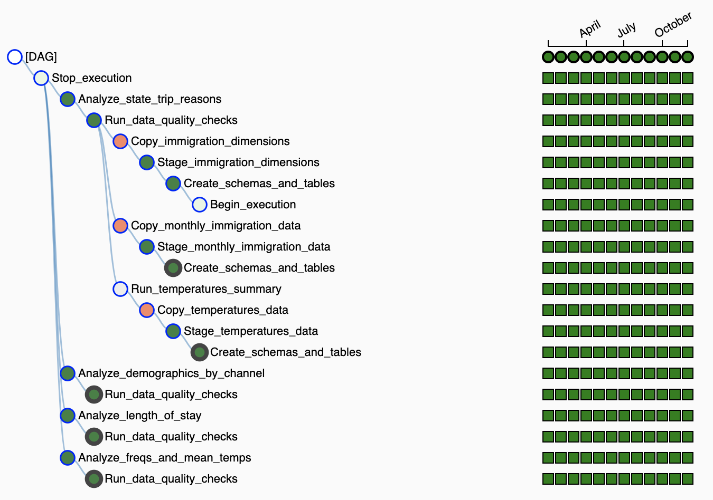
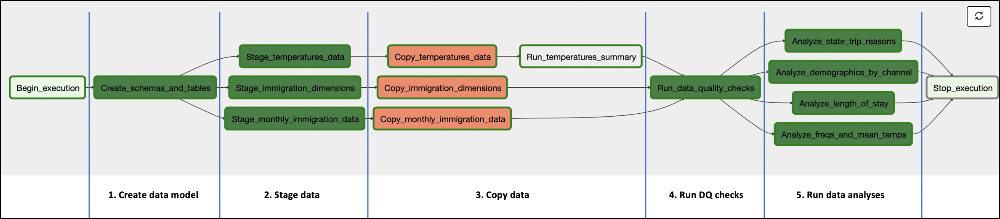

# Data Engineering NanoDegree: Capstone project

In this project, I design a fully automated ETL process leveraging Airflow, Pandas, 
AWS (I.e. s3 + Redshift) and Dask as core technologies.

---

## 1. Introduction and goals

The **goal of this project** is to satisfy the data needs of the analysts at a think tank focused on migratory movements around the world, and specifically the assessment of the ongoing shifts in the United States population. 

The team at our think tank is specially interested in the demographics of the U.S. visitors, including their ages, their motivation and means to travel, and the influence of 
climate in these movements.

**This ETL is intended to solve this need by creating a system that**:
- Runs in an automated fashion
- Runs in a monthly schedule
- Analyzes the demographics of the people arriving at the U.S. during the studied month
- Delivers high quality data that can be queried by the team of analysts for each monthly run

---

## 2. Project resources

The project contains the following resources, which will be referenced in the following sections:

- **`airflow` directory**: Contains all the code for our automated ETL pipeline
- **`ETL walkthrough.ipynb`**: Notebook depicting the ETL steps and showing methods, intermediate results and code base
- **`additional_resources/data_dictionary.md`**: Data dictionary containing descriptions of all tables in our data model - described ahead in section 4
---

## 3. Input data

Two main sources of data are used. These are:

- **i94 immigration data**: : This data comes from the US National Tourism and Trade Office - [here](https://travel.trade.gov/research/reports/i94/historical/2016.html). The data is stored in s3, transformed from its original CSV files into Parquet files. The data has a monthly segmentation, where an example file has the name `i94_jan16_sub.parquet`. This data also comes with mapping dictionaries explaining the encoding of certain variables, which can be found at `/additional_resources/I94_SAS_Labels_Descriptions.SAS`

- **World Temperature Data**: This dataset is publicly available on Kaggle - [here](https://www.kaggle.com/berkeleyearth/climate-change-earth-surface-temperature-data).

---

## 4. Data model

The data model chosen is a Redshift database, with a total of 3 schemas.

For full reference on the data model please refer to `additional_resources/data_dictionary.md`.

### 4.1. The `immigration` schema

This schema contains all the information relative to the i94 data. Specifically, the schema contains a total of 6 tables:
- `us_entries`: Fact table containing all the entry records throughout months. The new data is inserted for new months, with fields identifying the month and year of the record
- `country_codes`: Dimension table mapping from country code to country name, applying to the fields `i94res` and `i94cit` in the table `us_entries`
- `port_codes`: Dimension table mapping from airport code to name, applying to the field `i94port` in the table `us_entries`.
- `entry_channel_codes`: Dimension table mapping from entry channel to entry name, applying to the field `i94mode` in the `us_entries` table
- `state_codes`: Dimension table mapping from U.S. state code to name, applying to the field `i94addr` in the `us_entries` table
- `trip_reason_codes`: Dimension table mapping from collapsed visa type code to trip reason, and applying to the field `i94visa` in the `us_entries` table

### 4.2. The`temperature` schema

This schema contains the data relative to world temperatures. Specifically, the schema contains two tables:
- `full_temperature_data`: This table contains the historical series of data, with no transformation over the input file
- `temp_summary`: This table contains a country level summary of the mean and standard deviation of the temperature throughout the available historical series

### 4.3. The `outputs` schema

This schema stores the outputs of each one of the different questions asked to the data. Specifically, the schema contains 12 (months in 2016) x 4 (types of analysis) = 48 tables. These tables are the following:

- `{month}{year}_demographics_by_channel`: These tables contain the mean age by gender and channel of arrival into the US for the selected month.
- `{month}{year}_length_of_stay`: These tables contain the mean stay in the U.S. (in days) by country of origin for the selected month.
- `{month}{year}_state_trip_reasons`: These tables contain a breakdown of the number of people traveling to each state by trip motive during the selected month.
- `{month}{year}_freqs_and_mean_temps`: These tables display the frequency of travelers by country in the analyzed month, and also displays the historical mean temperature and the standard deviation of the series for the country.

---

## 5. The ETL pipeline

The pipeline is scheduled to run in a monthly basis, completing a series of steps or tasks. At the end of these steps the pipeline will have generated the files corresponding to the month of analysis for the analysts at our think tank to work with.

The pipeline has been successfully run for every month of the year 2016, as can be seen in the image below:

The pipeline is divided in a total of 15 tasks, which we can divide in a total of 5 blocks as shown below:

The 5 blocks are the following:

1. **Create data model**: The schemas and tables described in section 3 are created
2. **Stage data**: Data is preprocessed and moved into the staging area in s3
3. **Copy data**: Curated data is copied into Redshift tables, and additional tables are created through transformations
4. **Run DQ checks**: Data quality checks are ran to ensure that the tables have been correctly created
5. **Run data analyses**: The necessary queries to generate the contents of the `outputs` schema are ran.

Technical documentation around these tasks and choices made can be found at `ETL walkthrough.ipynb`.

---

## 6. "What if" scenarios

As part of the project we consider how our current ETL would cope with a series of circumstances unexpected. These are:

1. **Data increased by x100**: In this case the ETL would not be considerable affected. Specifically, given that we have a monthly SLA for the delivery of the data, increased computation times are not expected to become a problem. On the other hand, if the in-memory manipulation of data became problematic during the data staging process, Spark or Dask could be used to replace Pandas-based computations, which are currently more than sufficient given the monthly i94 data volumes - see annex of `ETL walkthrough.ipynb`.

2. **Daily SLA, due at 7 AM**: Since computation time for monthly data within the Airflow pipeline is in the order of minutes, changing the delivery schedule from @monthly to @daily would not disrupt the current pipeline.

3. **Database accessed by 100+ people**: Since our database is in Redshift, we would be able to scale our service to allow for a higher number of concurrent users / traffic limits, with the caveat of the added costs. 

